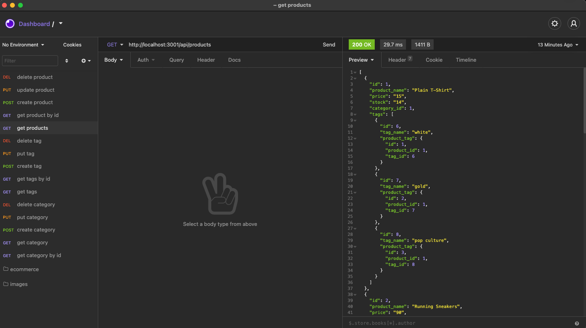

# E-Commerce Backend

Demo link: (https://youtu.be/OiuAFY3NUDU)

## Description

This is an ecommerce website backend made using mysql and sequelize.  

## Installation

    run schema.sql file in mysql workbench & run "npm install" then "npm run seed" & "npm run start" in terminal. You can then make your requests via insomnia  

## Built With

* [node.js](https://nodejs.org/en/)

* [mysql2](https://www.npmjs.com/package/mysql2)

* [dotenv](https://www.npmjs.com/package/dotenv)

* [sequelize](https://sequelize.org/)

* [javascript](https://developer.mozilla.org/en-US/docs/Web/javascript)

## Usage Instructions

    Once in Insomnia or other similar software you now can create, update, delete, and add catagories, products and product tags. See video and screenshot for more information.

## Contributers

William Farnsworth - [Github](https://github.com/Cynwise)
